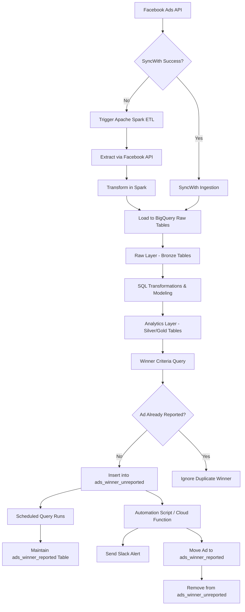

## Automated Ads Analytics & Pipeline

### Overview

**Automated Ads Analytics & Pipeline** is an end-to-end, fault-tolerant marketing data engineering and analytics system designed to ingest, transform, analyze, and automate insights from Facebook Ads data. The pipeline ensures reliable data ingestion with a primary connector and a fallback Spark-based ETL, structured transformations in BigQuery, automated winner detection logic, and real-time Slack alerts.

This project integrates **data engineering, analytics engineering, business intelligence, and automation** into a single scalable system.

---

## Architecture Overview

---

## Tech Stack

* **Data Source:** Facebook Ads API
* **Primary Ingestion:** SyncWith
* **Fallback Ingestion:** Apache Spark
* **Data Warehouse:** Google BigQuery
* **Transformations:** SQL (Analytics Engineering)
* **BI Visualization:** Looker
* **Automation & Alerts:** Slack + Scheduled Jobs / Cloud Functions

---

## Data Pipeline Layers

### 1. Ingestion Layer

#### Primary Ingestion

* SyncWith extracts Facebook Ads data and loads it into BigQuery Raw tables.

#### Fallback Ingestion (Fault Tolerance)

* If SyncWith fails due to API errors, quota limits, or connector downtime:

  * Apache Spark triggers a direct API extraction.
  * Spark normalizes schemas and loads data into BigQuery Raw tables.

---

### 2. Raw Data Layer (Bronze)

Stores unprocessed ingestion data.

**Example Tables:**

* `fb_ads_raw_campaigns`
* `fb_ads_raw_adsets`
* `fb_ads_raw_ads`
* `fb_ads_raw_metrics_daily`

---

### 3. Transformation Layer (Silver / Gold)

SQL transformations in BigQuery create analytics-ready datasets.

**Transformations Include:**

* Deduplication and schema normalization
* Metric calculations (CTR, CPC, CPA, ROAS, Conversion Rate)
* Campaign, Adset, and Ad-level joins
* Time-series aggregation and breakdown modeling

**Example Modeled Table:**

* `fb_ads_fact_performance_daily`

---

## Winner Detection Logic

A scheduled SQL job evaluates ads based on predefined performance criteria.

### Example Winner Criteria

* CTR ≥ 2%
* ROAS ≥ 2
* CPA ≤ target threshold
* Spend ≥ minimum spend threshold
* Conversions ≥ minimum conversion count

---

## Winner State Management Tables

### `ads_winner_unreported`

Stores newly detected winning ads that have **not yet been sent to Slack**.

### `ads_winner_reported`

Stores ads that have already been reported to prevent duplicate alerts.

---

## Scheduled Query Workflow

1. Scheduled query runs periodically (hourly/daily).
2. Detects new winners from transformed tables.
3. Inserts new winners into `ads_winner_unreported`.
4. Skips ads already present in `ads_winner_reported`.

---

## Automation & Slack Alerting

A scheduled automation job (Cloud Function / Script / Airflow):

1. Reads records from `ads_winner_unreported`.
2. Sends structured alerts to Slack (Ad name, Campaign, Metrics).
3. Inserts alerted ads into `ads_winner_reported`.
4. Removes them from `ads_winner_unreported`.

This ensures **idempotent alerting** and prevents duplicate notifications.

---

## Key Features

* Fault-tolerant ingestion (Primary + Spark fallback)
* Layered BigQuery architecture (Bronze / Silver / Gold)
* Automated performance modeling
* Real-time ad winner detection
* Slack alert automation with state tracking
* Scalable and production-ready design

---

## Use Cases

* Marketing performance monitoring
* Automated campaign optimization
* Data-driven ad scaling decisions
* BI reporting for marketing teams

---

## Future Enhancements

* Airflow orchestration for pipeline scheduling
* Machine learning-based winner prediction
* Auto budget reallocation system
* Multi-platform ingestion (Google Ads, TikTok Ads)

---

## Developer

**Ahad Moeen**
Data Analyst & AI Analytics Engineer
